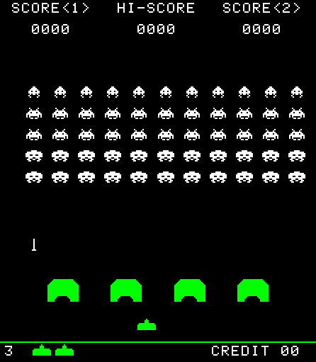

# Not Space Invaders

Not Space Invaders is a clone of the 1978 arcade classic Space Invaders with more realistic 2D physics added into the mix. Nobody asked for them, but I added them anyway.

It is still in development. To run it on Linux, download the files and run
```
love ./
```
on the root folder (where ```main-lua``` is located). Make sure you have LÖVE 11.0 or higher installed.

You can also run it on Windows or wherever LÖVE runs, which can be done by learning how to do that.

### Controls

Controls are simple enough, simply use the keyboard arrow keys to control the ship and spacebar to fire.

### Screenshot

Below is a screenshot of the game in its current state (check the image commit to see which version it is).



### Acknowledgements

This project is inspired by the work of [Stabyourself.net](http://stabyourself.net/).

The sprites used were taken from [this sprite sheet](https://www.spriters-resource.com/arcade/spaceinv/sheet/8593/) at The Spriters Resource. All credits go to its original submitter.

Also full acknowledgements to the developers of the original arcade Space Invaders. All rights reserved to whoever owns them (I'm guessing Taito, but I'm no lawyer).